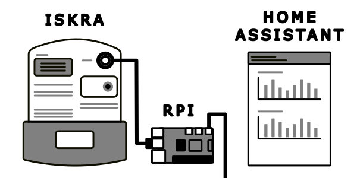

# ISKRA Electricity Server

The **ISKRA Electricity Server** enables you to read out your ISKRA electricity meter and serve the current **total energy consumption** via a http endpoint.

This endpoint can then be used to add a custom [RESTful Sensor](https://www.home-assistant.io/integrations/sensor.rest/) in [Home Assistant](https://www.home-assistant.io/) for displaying your energy consumption.

## Demo



TODO: describe the setup

## Prerequisites

For this setup to work

- an ISKRA energy meter with an infrared interface
- infrared to usb reader
- a Raspberry Pi (or something similar) with docker installed

This setup was tested with an [ISKRA energy meter](https://lackmann.de/hardware/elektrizitaetszaehler/MT175) and an IR USB reader/writer from [Weidmann Elektronik](https://shop.weidmann-elektronik.de/index.php?page=product&info=24).

### Server setup

The server (e.g. Raspberry Pi) needs to have **docker** installed. Please follow the [official instructions](https://docs.docker.com/engine/install/) to do so.

### IR reader setup

Connect the IR reader to your energy meter (usually magnetic) and your server via USB. It is possible to test the setup like this:

Install minicom:

```
sudo apt update
sudo apt install minicom
```

Run minicom:

```
sudo minicom -s
```

Then you can select **serial port setup**. The output will look something like that:

```
Serial port setup ->
    | A -    Serial Device      : /dev/ttyUSB0 |
    | B - Lockfile Location     : /var/lock    |
    | C -   Callin Program      :              |
    | D -  Callout Program      :              |
    | E -    Bps/Par/Bits       : 9600 8N1     |
    | F - Hardware Flow Control : Yes          |
    | G - Software Flow Control : No           |
```

Configure the device:

```
sudo stty -F /dev/ttyUSB0 1:0:8bd:0:3:1c:7f:15:4:5:1:0:11:13:1a:0:12:f:17:16:0:0:0:0:0:0:0:0:0:0:0:0:0:0:0:0
```

Afterwards you can read out the interface and present it in sml (smart meter language) hex format:

```
sudo cat /dev/ttyUSB0 | od -tx1
```

## Deployment

You can grab the `docker-compose.yml`, put it on your server and deploy it via `docker compose up -d`.

## Usage in Home Assistant

TODO: Write down how to do it
